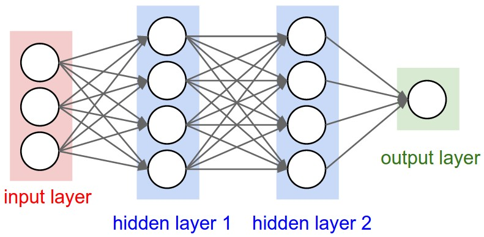

# Udacity's Banana field training report

## Algorithm
This projects implements the popular Deep Q-Learning algorithm (_DQN_) based on this [paper](https://storage.googleapis.com/deepmind-media/dqn/DQNNaturePaper.pdf).
The algorithm is based on the Deep Q-Network coding exercise of the Udacity Deep Reinforcement Learning course. 
Since the environment gives detailed information about the states, compared to only visual information, 
no convolutional networks are needed. The neural network architecture is a fully connected network that has one input layer with 37 inputs, 
2 hidden layers with each 64 inputs and 1 output layer with 4 output values (one for each action).

## Hyper-parameters

| Hyper-parameter name | Value   | Detailed meaning                       |
| :---:                |:----:   | :---:                                  |
| batch-size     | 64      | Number of samples trained in each step |
| τ               | 1e-3    | Soft update for target network weights |
| update_frequency     | 4       | Update frequency for target network    |
| γ             | 0.99    | Discount factor                        |
| Replay buffer size   | 1e5     | Capacity of the replay buffer          |
| α	             | 5e-4    | Learning rate for gradient descent     |
| ϵ           |[0.01, 1]| The probability of an agent randomly choosing an action |
| ϵ decay     | 0.995   | Decay rate for epsilon                 |

## Results

The problem is solved (average reward > 13.0) in 461 episodes. A plot of the training curve is shown below

below is a example video of a trained agent

## Improvements

Future work will address implementation of more advanced DQN techniques such as _Double DQN_, _Prioritized Experience Replay_ or _Dueling DQN_

